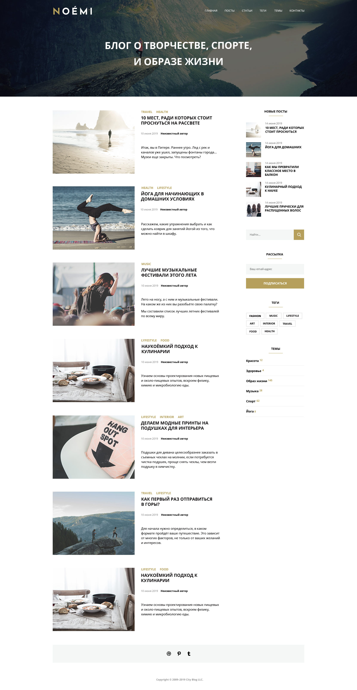

# Дипломный проект на курсе «HTML-вёрстка: с нуля до первого макета»

В рамках дипломного проекта нужно сверстать макет сайта, который выглядит, как на скрине:

## Итог

Была сделана верстка данного макета, все файлы находятся в репозитории.